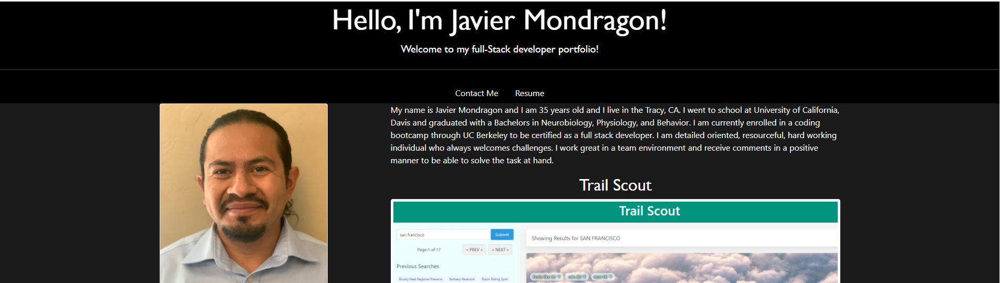

# Updated-Portfolio

## Summary
This application contains my updated full stack developer portfolio. The application contains an about me, a recent photo, a list of my work, and a contact me section. In the application the user will greeted with a hello and a statement saying my name and welcome to my portfolio. The user is can then scroll down to the navigation bar and click on links to my contact me section or click on my resume link to download my resume. 

On the left side of the page is a sidebar that contains my photo, my name, a list of my projects and mini-projects, and the bottom my contact information and a link to my gitHub. If the user would like to see one of my projects or one of my homeworks, the user can click on the project name and screen shot of my project will show on the right side of the page. Also, at the bottom of the screenshot, a link to the project's repository page will be displayed and a live link to the deploy url will also be displayed. If the user wants to view the other projects, it is as easy as just clicking on the name of the project and the information of the previous project disappears and the information for the new project appears.

## Site
